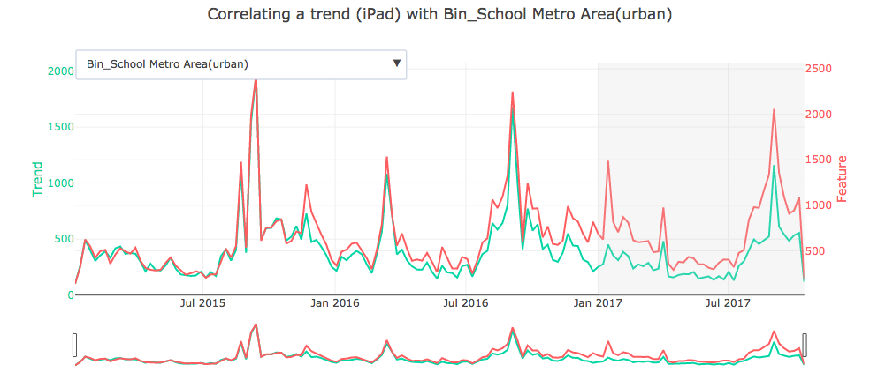
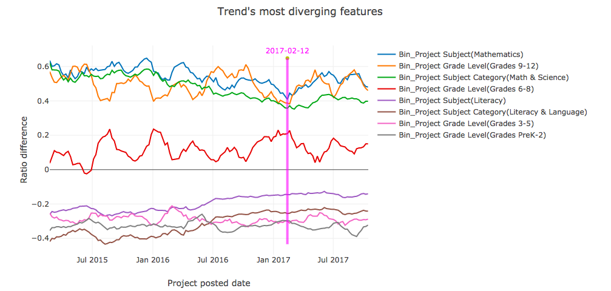
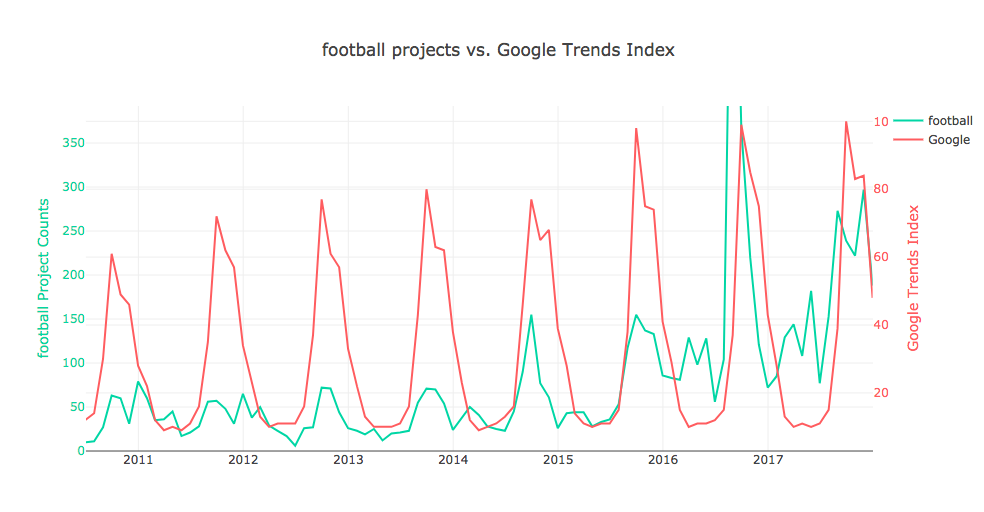

# Demographic analysis (demo)
 
The objective of this part of the analysis is to dive into the deeper connections between trends and demographic features in the projects dataset. The assumption is that when a new technology is becoming popular, it might gain traction within certain communities more than others. Identifying which demographic features are driving a certain trend can help derive actionable insights like how to better target marketing, adjust inventory, generate media attention, etc…

To this end, two different approaches were taken. First, the correlation analysis provides some insight into which features behave like the desired trend. Secondly, the ratio analysis helps to hone in on those features that are strongly diverging from their expected behavior. Both approaches are described in more detail below.
 
## Usage
 
### Initialization
 
As a first step, we load the dataframe, and instantiate the Correlator class:

```python
df = pd.read_csv("../DC.org/all_technology_projects.csv")
cor = demo.Correlator(df, start_date="2015-01-01", end_date="2017-10-15")
```

Let's look at a few example trends. We can pass a dict with the trends identified by TrendFinder to the `find_trends()` method. This method can also search for keywords in a specified field by passing `list_of_keywords` and `field` if necessary.

```python
keywords_dict = {
    'iPad': ['a743d5cd4987948143909885237e17d0', '660c0273905787e965582fc82cba28d2'],
    'projector': ['e689ea020bd75bc907682f7cab05682a', '753258f2e6b6db038522a8987d2cf3e7']
              }
cor.find_trends(keywords_dict=keywords_dict)
```

The analysis can be performed on any time interval. We've found that a monthly groupby is a good place to start. The `prop` parameter can be set to True to compute the dataframe as proportions instead of raw counts.

```python
cor.get_categorical_trends(trend_keywords, prop=False, thres=-1)
```

### Correlation analysis
 
The correlation analysis computes the Spearman correlation of each trend with the features, to identify which demographics (or subjects) are highly correlated and are likely driving the trend.
Since we are dealing with a time-series, we can't assume the datapoints are statistically independent because of the dependency on time.
For this assumption to be true, we must first stationarize the data. This is done by taking the first differences and then removing yearly stationarity (the latter is optional, this is only done if `yearly_seasonality` is passed). We then run each column through a Dickey-Fuller test to ensure it is stationary and the correlation is therefore statistically meaningful. We only retain those columns that passed the test.

```python
cor.stationarize(yearly_seasonality=52)
cor.stationarity_test_all()
```

The `compare_corrs()` method computes the correlations, and returns a dataframe where columns are trends and rows are features. Use the `date_cutoff` parameter to only compute the correlation from a certain date onwards (this is useful when examining a specific trend).

```python
cor.compare_corrs(date_cutoff='2017-01-01')
```

Once we have the correlations, we can use `top_corrs` to choose to look at a specific trend and narrow them down to those that are above a specific cutoff.

```python
cor.top_corrs('iPad', thres=0.25, n=5)
```

We can then plot that trend and visually examine its correlation with its demographic features. Note that the correlation analysis was applied to the stationized (cor.diff_grouped) dataframe, while the original (cor.grouped) dataframe is used for plotting, for better readability.

```python
plot_trend_features(cor.grouped, trend='iPad', passed_features=cor.passed_features, date_cutoff='2017-01-01')
```


In this example, we find that iPads are highly correlated with the schools being in urban areas. This makes sense and serves as a form of sanity check, since this accounts for a large chunk of the projects.

### Ratio analysis
 
The purpose of the ratio analysis is to compare the prevalence of certain demographics within  a trend with their baseline (usual) proportions among the rest of the projects. The ratio for every feature is first computed within every time-frame (this can be done on a weekly, biweekly, monthly, etc... basis) on the entire projects dataset. This serves as our baseline ratios. We then compute those ratios only for the subset of projects that were identified as being part of a certain trend by TrendFinder, and finally the difference between the two is taken.

```python
features = [col for col in cor.df.columns if 'Bin' in col]
diffs = compare_ratios(cor.df, cor.grouped, trend='calculator', features=features)
```

We then plot the ratio differences, limiting it to those that diverge more than the set threshold (with the `thres` parameter). We can also limit the features being presented to `Subject`, `Poverty`, `Metro`, `Grade` and/or `Various` with the `feat_type` parameter. The latter bundles the various features that don't fall into the other groups. Features that have greater positive values are highly prevalent in the trend, whereas negative ones are underrepresented compared to the baseline. Pass a key date to `date_line` to visualize when the trend starts.

```python
plot_diffs(diffs, feat_type=['Subject', 'Poverty', 'Metro', 'Grade', 'Various'], thres=0.1, date_line='2017-02-12')
```


In this example, the 'calculator' trend is clearly driven by subjects involving maths, and its counts are weak in the liberal arts subjects such as Literacy and Language. It's also much more prevalent among older students and underrepresented in the lower grades.

### Google Trends index

This last analysis isn't specifically about demographic features, but is helpful to compare a trend with its popularity across the broader internet community. This addresses questions such as how quickly teachers catch onto a trend, or whether it is part of a greater seasonal behavior. The `ggl_trends()` method uses a package called pytrends to scrape the Google Trends index over the past 5 years in the US for the trend we're interested in. Notes: Google will return an empty data frame when the trend isn't significant enough, and the [pytrends](https://github.com/GeneralMills/pytrends) package is actively maintained as of May 2018. Remove this analysis if this changes.

Finally, `plot_ggl_trends()` plots the results.

```python
google_trends = ggl_trends(cor.grouped, 'football')

plot_ggl_trends(google_trends, 'football', plot=False)
```
