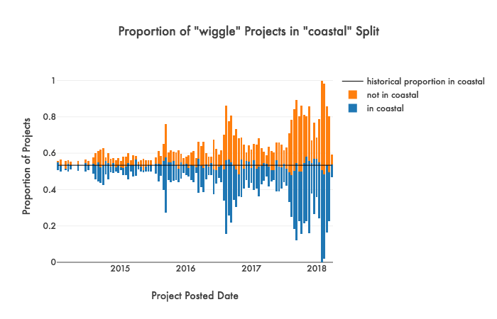
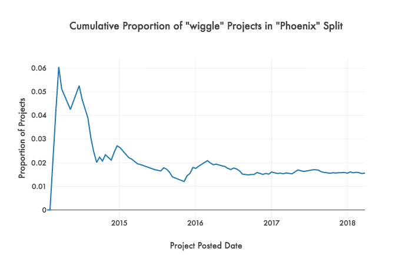
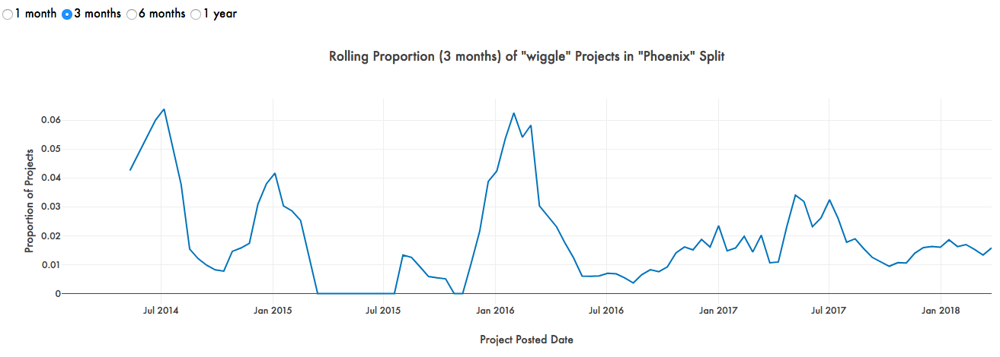

# Geographic analysis (geo)

The primary goal of the geographic analysis part of the pipeline is to provide the user with some insight as to how trends are spreading geographically. Generally, these analyses rely on the "**School State**," "**School County**," and "**School Metro Area**" columns from the data.

We aimed at capturing spread at a number of levels, focusing on not only macro (e.g. coastal vs. non-coastal, urban vs. non-urban), but also micro "splits" (e.g. in NYC vs. not in NYC, etc.). These are custom-defined as part of our backend reference, but these can be easily modified. Any pre-defined split can be selected on the live dashboard for a trend, with the dropdown is pre-sorted from top to bottom by a calculated "trendiness" factor.

```python
# (geo refers to a previously initialized GeoMeta object for performing all geographic analyses with)
trendiest = geo.find_trendiest()
```

## Different types of graphs

To show changes over time in geography, TrendFinder has 3 types of plots that each require its own interpretation. 

For usability purposes, the live dashboard currently unifies the dropdown for the geographic split such that all of the plots will update together accordingly when the top dropdown is changed.

### Proportion over time bewteen splits

The first plot on the dashboard provides a high-level overview of how the general proportion of projects containing a specific word differs by geographic split over time. The bars are "centered" on a black line that represents what the aggregate proportion difference is (for all time). This means that if the color of the bar crosses the line, then that binarized value is overrepresented at that specific time grouping. This anchoring is designed to illuminate any major shifts from one part of the geographic split to the other over time. 

As an example, in this plot, "wiggle" projects fluctuated between being slightly overrepresented in coastal and non-coastal regions towards the end of 2017 into 2018.

```python
plot_splits_out = geo.plot_splits("wiggle")
```


### Cumulative proportion in specific split

To show how over or underrepresented a specific geographic split was over time in the context of all projects, the cumulative proportion of projects is plotted. This graph essentially represents how much of all projects up until a specific time point existed in a specific region, which best captures any early spikes to identify potential early adopters or "trendsetters."

In the plot below, Phoenix appears to be an early adopter for "wiggle" projects, eventually flattening out to what is likely the overall historical baseline proportion for "wiggle" projects in Phoenix over time.

```python
plot_cumulative_out = geo.plot_cumulative_splits("wiggle")
```


### Rolling proportion in specific split

Since cumulative proportion does not do a great job of capturing "localized" changes throughout time (the cumulative proportion has a tendency to "swallow" variance the farther along time it runs), there is also a "rolling" proportion option that calculates a proportion using a window of time in the past to represent a present time point's value. This way, one can see when a trend has relative spikes and troughs in its history within the specific geographic split, relative to the rest of the geography.

The window for calculating the rolling proportion can be modified as a toggle on the dashboard with whatever pre-loaded options were fed into the construction of the graph. Recalling earlier that Phoenix had a primary spike at the beginning of "wiggle" projects' history, this graph shows that the city experienced a more localized spike around the beginning of 2016.

```python
# Can be modified in source for different options
windows = [geo.ONE_MONTH, geo.THREE_MONTHS, geo.SIX_MONTHS,geo.ONE_YEAR]

for window in windows:
    plot_rolling_out = geo.plot_rolling_splits("wiggle", window=window)
```


## Geographic mappings

As mentioned earlier, we have already created a set of pre-defined mappings for different geographic regions at various levels. These mappings can be easily created or changed to show any specific region(s) of interest. All splits are located in [/lib/geo_data/geo_mappings.py](../lib/geo_data/geo_mappings.py). To show an example, here is how the NYC split is defined.

```python
# Counties in New York City
NYC_LIST = ['Queens County, New York', 'Kings County, New York', 'New York County, New York',
            'Bronx County, New York', 'Richmond County, New York', 'Westchester County, New York',
            'Nassau County, New York']
```

This list is later used as a mapping for a dictionary entry for "NYC."

```python
ALL_SPLITS = {
    # ... 
    'NYC': {
      'column': 'county_full', 
      'list': NYC_LIST
    }, 
    # ...
}
```

The "**county_full**" column here is created in geo.py, as splits are generated and calculated at the beginning of running the geographic pipeline component.

```python
geo = g.GeoMeta(subset_df)
geo.get_all_splits()
```