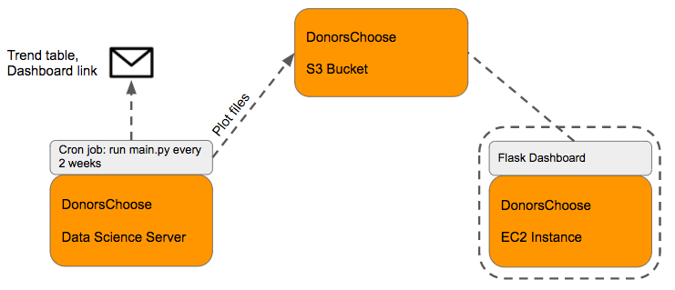
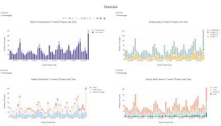
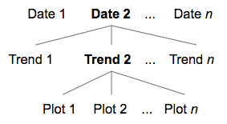

# TrendFinder Deployment Infrastructure

The TrendFinder dashboard is deployed with several services from Amazon Web Services. At time of handoff, the app is deployed [here](http://trendfinder.us-east-1.elasticbeanstalk.com/). In this document, we will first discuss the infrastructure of the app and then we will cover instructions on how to deploy the app.

## Infrastructure

There are three components to the TrendFinder app:



1. Running the TrendFinder pipeline (left): The TrendFinder pipeline connects to a DonorsChoose data source, detects trends, runs the geographic and demographic analyses, and outputs data for plotting to AWS S3. The pipeline file is ran via `cron` on a weekly or bi-weekly basis.
2. Storing the output of the pipeline (middle): An S3 bucket (currently `donorschoose-trends`) is used to store the pipeline outputs in a hierarchical structure. The pipeline writes to this bucket and the dashboard reads from this bucket.
3. Running the dashboard server (right): A Flask application is responsible for serving the dashboard to clients. This application is ran on an AWS EC2 instance inside an AWS Elastic Beanstalk (EB) environment, which hosts it at a URL and provides easy deployment and scaling configuration.

Let's talk through how these components interact. First, the TrendFinder pipeline identifies words that are currently trending in the DonorsChoose data. Then, for each of these trends, the TrendFinder pipeline calls several functions that generate the plots that you see on the dashboard site: 



The TrendFinder pipeline is meant to be ran on a weekly or bi-weekly basis; every couple of weeks, new trends are discovered by the pipeline and new plots are generated. As part of the spec for the TrendFinder dashboard, we wanted to let users at DonorsChoose select both current and historical periods to analyze trends. Each of the trends discovered in these time periods then has plots associated with it that make up the dashboard view for that trend. We can think about this date > trend > plot setup as a hierarchy: 



We adopt this hierarchical structure to use with S3. Every time the TrendFinder pipeline is ran, it creates a prefix for the date it's being ran on (e.g. "2018-03-14") in the S3 bucket and stores the trend information and associated plot data with this prefix. Then, each trend word is used as a nested prefix to store plot outputs for the given trend. Finally, the data for each plot is stored under a final nested prefix of the plot name. The following is an example of how this hierarchical structure is implemented in S3:
```
# donorschoose-trends/ (bucket)
#   2018-03-14/
#   2018-03-28/
#       df.csv	# contains the discovered trends
#       trend_1/ # each trend prefix here is a row in df.csv above
#       trend_2/
#       ...
#       trend_n/
#           plot_1/ # each plot corresponds to a dashboard element
#           plot_2/
#           ...
#           plot_n/
#               df.csv
#               kwargs.json (exclude for tables)
```
We made the choice to use S3 to store this form of data for several reasons. First, it is easier to work with files for table input-to-plotting functions; storing these files on a cloud-based file store is a better option than trying to store them as part of database tables. Second, S3 is easier to maintain if new plots are added to the dashboard, as a new plot prefix can simply be used moving forward. 

On the pipeline side, for each date, we write this data in simple for loops for each trend-plot pair. On the dashboard side, we read this data in as a nested dictionary, where the .csv files are read in as Pandas dataframes and the .json files as dictionaries. This nested dictionary serves as a basis for navigating the hierarchy in the dashboard. In both cases, hierarchical storage on S3 is an intuitive representation of the data.

See [here](trend_detection.md) for specific documentation on the TrendFinder pipeline and [here](dashboard_creation.md) for specific documentation on the dashboard side.

## Instructions

To deploy this infrastructure, we created a new AWS account and took advantage of the AWS Free Tier (**Note: This will expire at some point down the road**). First, we'll go over initial account configuration settings and then we'll cover instructions to set up each of the three infrastructure components.

### Account Setup

1. To create an account, follow the instructions [here](https://aws.amazon.com/premiumsupport/knowledge-center/create-and-activate-aws-account/).
2. At this point, we've created an AWS account and a user with root access. Users with root access can view and change billing info so we may not want people to use this account if they're managing resources. For this, we'll create an IAM user with administrator access.
3. Let's create an IAM user named trend_finder.
    * Begin by going through steps 1-3 in the instructions. [here](https://docs.aws.amazon.com/IAM/latest/UserGuide/id_users_create.html#id_users_create_console) as written.
    * On step 4, select AWS Management Console access and autogenerated password (we'll change the password later).
    * Follow step 5 as written.
    * On step 6, we'll create a new group. Click `create group` and use the group name `admin`. Select the `AdministratorAccess` policy. Click `Create group` and assign the user to the `admin` group.
5. Click through the Review screen and arrive at the Success screen. The Success screen displays the security credentials of this account. **This is the only time we'll be able to view the access key and secret key credentials. Click `Download .csv` to store the credentials locally.**
	* **Warning: Do not share these credentials over any public channels, including GitHub repositories.**
6. Now, open `credentials.csv` and go to the console login location in your browser. Enter your credentials and follow the password reset protocol. You should be logged back into the console as the IAM user.

Great, now we're set with account creation. Let's quickly go over some setup that needs to happen on the DonorsChoose data science server.

### DonorsChoose Data Science Server setup
We'll be accessing AWS since this server is running our `main.py` `cron` job. We need to make sure it has access to our AWS account. 
1. Make sure you have the AWS CLI installed (read: _not_ the ElasticBeanstalk CLI discussed later) on the server by running `pip install awscli`. 
2. Run `aws configure` and type in the access key id and secret access key for the `trend_finder` user found in the `credentials.csv` file. For this use case, use the `us-east-1` region.

Now that server setup is done, let's move onto setting up S3.

### S3 Setup
1. Logged in as the trend_finder user, log into the AWS management console. 
2. Under `Services`, click S3. 
3. Click the `Create bucket` button. Here, enter a unique bucket name, such as `donorschoose-trends`.
	1. As part of our handoff, we've already gone through this setup process on our test AWS account. Depending on how DonorsChoose decides to use that account, the `donorschoose-trends` bucket may still exist on AWS and that bucket name will be unavailable. If that is the case, choose another unique name and edit the `bucket` variable in `main.py` and `lib/application.py` to the name of the bucket.
4. Use the US East (N. Virginia) option for Region (closest option).

Sweet, that's all the S3 setup we need to do. Let's create the ElasticBeanstalk setup.

### ElasticBeanstalk setup
(Note: The following directions are adapted from a [Medium article](https://medium.com/@rodkey/deploying-a-flask-application-on-aws-a72daba6bb80) and official [AWS documentation](https://docs.aws.amazon.com/elasticbeanstalk/latest/dg/create-deploy-python-flask.html)).

Clone this git repository to your local machine and navigate to the `./lib/` directory. First, we're going to do some initial configuration to configure our local codebase for deployment on AWS EB. If you want to learn more about EB, you can do so [here](https://docs.aws.amazon.com/elasticbeanstalk/latest/dg/concepts.html).

1. Make sure AWS Elastic Beanstalk Command Line Interface (EBCLI) is installed by running `pip install awsebcli`. 
2. Make sure you're in the `./lib/` directory; the `application.py` and `requirements.txt` files for the Flask need to be in the directory you're working in. 
3. Run `eb init`. Do the following for the prompts:
	1. Select the `us-east-1` region
	2. Provide your AWS Access ID and AWS Secret Key. 
	3. Select `Create new Application`. 
	4. Enter `trendfinder` as the environment name. 
	5. Enter `y` to confirm we're using Python.
	6. Select `Python 3.6` for the platform version.
	7. Opt `n` for setting up SSH on instances.

Great, we've created our first application for use with EB. Next, we're going to actually deploy the application. To do this, we have to create and deploy an EB environment that runs our application.

1. Run `eb create`. For the environment name, enter `trendfinder` and for the DNS CNAME prefix enter `trendfinder`.
	* Again, we've configured our hand-off environment to use this CNAME; if this environment still exists, the CNAME may not be available so you can use something like `trendfinder1`.
2. Give this a few minutes. The following things are happening: 
	1. The EB environment is being created.
	2. The codebase as it is currently is being versioned and automatically uploaded to an S3 bucket corresponding to the application version (we won't have to do anything for this).
	3. An EC2 instance will be newly created and the application code moved onto it from S3. 
	4. The `requirements.txt` will be installed onto the EC2 instance.
	5. The `application.py` file will be ran. 
3. After several minutes, the process will terminate. If there are no errors, you can run `eb name` to open the URL the dashboard is hosted at in your browser. If there is an error, keep reading.

The error is due to the EC2 instance not having permission to access the S3 bucket. Let's resolve this. 
5. Head over to [IAM management](https://console.aws.amazon.com/iam/home?region=us-east-1). Click on `Roles` on the left column.
6. When EB automatically creates EC2 instances on our behalf, it assigns IAM roles to these instances. Click on the `aws-elasticbeanstalk-ec2-role` role. 
7. On the Summary screen, under the Permissions tab, click "Attach Policy". Filter on "S3" and select the "AmazonS3ReadOnlyAccess" policy when the results populate.
8. Back at your command line, type `eb deploy trendfinder` to re-deploy the environment. Once this process is done, you should be able to access the live Trendfinder by typing `eb name`.

From now on, whenever you make changes to TrendFinder, you can run `eb deploy` from the `./lib/` directory to redeploy the updated code onto all EC2 instances in the environment.

### Managing the ElasticBeanstalk setup (cron specifics)
Great, so our setup is up and running! We have a little bit of maintenance to do on this environment moving forward. When the TrendFinder pipeline is ran every so often, it's going to add data to our `donorchoose-trends` bucket in S3. The dashboard application is not aware of these changes; it only pulls data from S3 into memory when `application.py` is ran by EB at start time. Therefore, after the TrendFinder pipeline is ran via `cron`, the application server(s) in our `trendfinder` environment need to be restarted so they can pull changes. 

To view the environment manually in the AWS console:

1. Log in to AWS console and head to `Services > Elastic Beanstalk`. 
2. On the top right corner in the nav bar, make sure the `US East (N. Virginia)` option is selected. 
3. Then in the grey sub nav, you should see the `trendfinder` application. Click this dropdown and click on the `trendfinder` environment. 

To restart application servers manually from the environment console view:
1. In the Actions button on the right, select and agree to `Restart server(s)`. After a few minutes of reading from S3 in `application.py`, you'll be good to go.

We can also restart application servers automatically on the data science server:
1. Go through the "DonorsChoose Data Science Server setup" on this page. 
2. Run `aws elasticbeanstalk restart-app-server --environment-name trendfinder --region us-east-1`. This will restart the app servers and the live app will be accessible after a few minutes after S3 reading is complete.
	* Running this command as a `cron` job after the trendfinder pipeline job will automate the restarting process.

We can use the EB console interface to manage the environment we've created moving forward.
1. Go to the "trendfinder" environment view.
2. We can view and edit the configuration of the environment. This includes the auto-scaling and load balancing options in the `Capacity` pane. By default, the environment is load balanced and can scale from 1 to 4 EC2 instances.
3. If we go to the Health option in the left menu, we can view the running instances in the environment.
