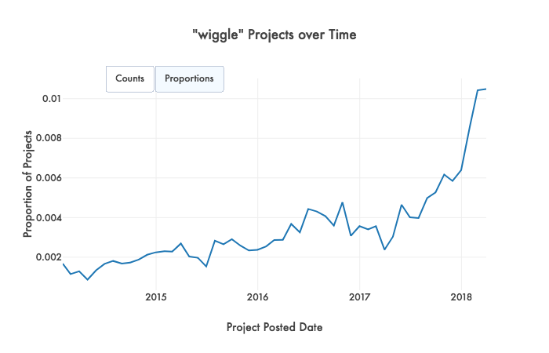
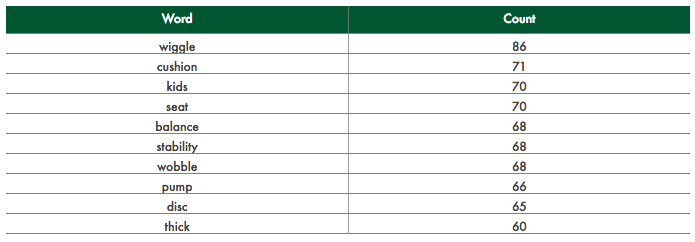

# Trend detection (TrendFinder)

Trend detection is handled by the TrendFinder class, which lives in its corresponding module. Broadly speaking, "trend" is defined in this use case as any large fluctuation in prevalence in the history of a specific keyword, with keywords being any word included in a cleaned resource/item name by default (this can be changed to detect keywords in titles, essays, etc.). A large fluctuation can indicate that something has spiked and died down (i.e. a fad) or gone up or down dramatically over time, representing perhaps some sort of paradigm shift.


TrendFinder was originally designed with these three types of trends in mind (not included here, but major troughs would also be detected), so it may struggle to pick up things with extreme volatility.

At a high level, trends are detected when they behave in a way that makes them statistical outliers when looking at their variation in proportion of total projects. Therefore, "trend detection" is loosely treated as a form of anomaly detection. It is important to note, however, that the algorithm that determines what exactly is picked up as a trend varies slightly between finding historical and current trends. Specifically, historical trends are identified via "*inter*"-word comparison, while current trends are identified via "*intra*"-word comparison.

## Preparing the data

TrendFinder expects an input of relevant text data (in the default use case, resources as "**Cleaned Item Name**") that includes a date(time) variable (e.g. "**Project Posted Date**", where each row is a unique project ("**Project ID**"). A neat feature of TrendFinder is that it can take in any subset of data and apply the same methodology to identify trends with that specific subset. For example, one could pass in pre-filtered data containing only "Trips and Visitors" projects and TrendFinder could provide specific trends to that category. Of course, sample size could be a limitation here.

To deal with resource data where there are multiple rows of different resources per single project, there is a `resource_formatter()` function that automatically consolidates everything into a tidy appropriate format for TrendFinder to be able to use.

TrendFinder does not perform much cleaning of its own, as it expects a "**Cleaned Item Name**" column input from DonorsChoose.org's database as lists of words where numbers and punctuation are removed and words are already reduced to lowercase. Each collection of resources per project is reduced to a set of unique words. Common English words, such as "and" and "I," are removed later in the process to avoid high upfront cleaning costs. Other than that, TrendFinder only removes null values. The data can be subsetted by date if needed by setting `subset_by_date` to `True` and passing in minimum and/or maximum dates as `min_date` and `max_date` arguments, respectively.

The main program file (for real-time detection) initiates a TrendFinder object with its default arguments.

```python
from lib import TrendFinder as tf

# (Expecting a .csv with Project ID, Project Posted Date, and Item Cleaned Resource Name)
resources = resource_formatter("resources.csv")
trend_finder = tf.TrendFinder(resources)
```

For historical analysis, where we looked at trends from 2008-2018, we initialized TrendFinder by passing the relevant date options in.

```python
trend_finder = tf.TrendFinder(resources, subset_by_date = True, min_date = "2008-01-01", max_date = "2018-01-01)
```

## Historical detection

After creating a TrendFinder object, historical trends can be identified by calling its `.find_historical_trends()` function.

```python
historical_trends = trend_finder.find_historical_trends(time_interval = "1M") # default
```

When looking for historical trends, TrendFinder applies a time grouping to the data available (subsetted by a certain date range if specified) and gets the statistical range (i.e. the difference between maximum and minimum values) of all the different proportions of projects containing a given word for all the time periods available. 

For example, if the set of proportions for a keyword was `[0.01, 0.05, 0.1, 0.09, 0.12, 0.5]`, then the range would be 0.11 (`0.12 - 0.01 = 0.11`).

After getting the range for every unique word in the corpus of text (a default cutoff requires a word to appear in at least 1/1000 projects to be considered here), the mean and standard deviation (SD) for all of these ranges is found, and statistical outliers (defined as being 2 SDs above the mean by default) are returned as potential trends. Using the earlier example, if the mean of all ranges was 0.05, and the standard deviation was 0.02, then the hypothetical outlier would be highlighted, since `0.11 > 0.05 + (2 x 0.02)`.

## Current ("real-time") detection

To avoid the misnomer, "real-time" in this context essentially refers to doing recurring trend detection in the present (i.e. looking at top trends every week or two), rather than operating on a continuous streaming time scale. Similar to finding historical trends, real-time trends can be discovered by calling a TrendFinder object's `.find_current_trends()` function.

```python
current_trends = trend_finder.find_current_trends(days_back = 14, groups = 50)
```

Like the historical trend-finding functionality, `.find_current_trends()` calculates the proportion of projects containing a keyword for all keywords found in the projects. However, it chooses its time periods by taking the current period (by default, the last 2 weeks), and crawling day-by-day backwards in history to create dynamic groups (by default, 50) that roughly contain the same amount of projects in order to ensure some degree of consistency and normalization with regard to sample bias, as its using proportions. Then, instead of comparing words with each other, words' current proportions are compared with their histories to identify whether or not the current period represents an anomaly in the context of its history, taking into account some level of volatility. This is defined by how much the current period's proportion deviates from the historical mean proportion in terms of standard deviations. Like, `.find_historical_trends()`, outliers are defined as being 2 SDs greater than the mean, so if a keyword was in 2% of projects in the current period, when normally the mean is 0.5% and the standard deviation is 0.25%, then this keyword would be flagged for detection, as `2 > 0.5 + (2 x 0.25)`. 

After retrieving the list of keywords that qualify as outliers, keywords are then ranked by a weighing scheme that basically multiplies the relative size of the current period's deviation (essentially a z-score) and its historical mean. Using the previous example, the weight for this keyword would be `((2 - 0.5) / 0.25) x 0.5) = 3`, with the current deviation being 6x the standard deviation. In the main program, this returned list of sorted trends gets formatted by a helper function and the data get written into the file tree for later dashboard table.

```python
current_trends_table = format_current_trends(current_trends)
# Outputs table data for dashboard use
pf.output_table_data(trend=None, df=current_trends_table, table_name=None, location=location, index=False)
```

## Additional functions

In addition to finding trends, the TrendFinder object has a built-in `.plot_xox()` feature that plots either the counts or proportions for any given trend on a XoX basis, with X being a time grouping such as year or month.

```python
trend_finder.plot_xox("wiggle", time_interval = "1M", prop = True, plot = True)
```


For contextualizing a resource keyword that may not be easily identifiable from a single word, TrendFinder also contains a `.find_co_occurences()` function for getting the top words that co-occur with any given word (removing stopwords), looking at the current period by default, since that's the one relevant to the intended use case.

```python
trend_finder.find_co_occurrences("wiggle", top_n = 10, current = True)
```

